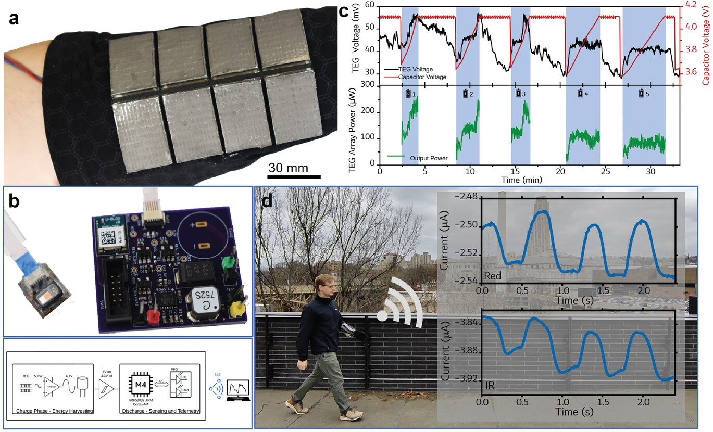

# TEGSense

The TEGSense project incorporates flexible thermoelectric generators (TEGs) into a battery-free, arm-worn wearable device that continuously collects red and infrared photoplethysmograph (PPG) waveforms, then transmists them over Bluetooth Low Energy (BLE) to an external device.
TEGs transduce a temperature differential to a voltage potential, and can be used to harvest energy from waste heat generated by the user.
Because the transduced voltage is small and the power generated is low, specialized electronics need to be used to capture and store enough energy to power a the sensor, microcontroller, and BLE transmission.

The figure below presents an outline of the project in a nutshell:

<ol type="a">
    <li>flexible TEGs are integrated into an arm-worn wearable (you can learn more about them in <a href="https://doi.org/10.1021/acsami.9b19837">this paper</a>);</li>
    <li>a custom-designed board with integrated ultra-low voltage boost converter, BLE-enabled microcontroller, and PPG sensor;</li>
    <li>the continuous charge and discharge cycle of the device;</li>
    <li>the output red and IR PPG waveforms.</li>
</ol>



## What's here?

This repository hosts the hardware, firmware, and software used for the TEGSense electronics.
If you're looking for information on how to make the TEGs, see [this paper](https://doi.org/10.1021/acsami.9b19837) instead.

There are three main divisions of the TEGSense electronics implementation: the front-end software, the on-board firmware, and the hardware.

### Front-end software

The [`ppgview`](https://github.com/TEGSense/ppgview) repository hosts a web-based frontend UI written in Python to view PPG waveforms in real-time and configure the on-board sensor.
Although part of the TEGSense project, this application can be used with any project making use of the MAX30101 PPG sensor.
It is extremely helpful for visualizing data and tuning the sensor parameters.


### Firmware

The firmware can be found in the [`firmware`](https://github.com/TEGSense/firmware) repository.
It is based around three primary pieces of hardware:

- [LTC3108](https://www.analog.com/en/products/ltc3108.html) "Ultralow Voltage Step-Up Converter and Power Manager" to use the low voltage output of the TEGs to charge a capacitor array;
- [MAX30101](https://www.analog.com/en/products/max30101.html) "High-Sensitivity Pulse Oximeter and Heart-Rate Sensor for Wearable Health" to collect red and infrared (IR) photoplethysmographs (PPGs) from the finger for heart rate and SpO<sub>2</sub> biometric monitoring;
- [BMD-350](https://www.u-blox.com/en/product/bmd-3035-series-open-cpu) "Stand-alone Bluetooth 5.0 low energy module" (based on the [Nordic nRF52832](https://www.nordicsemi.com/products/nrf52832) ARM processor) for low power device operation and Bluetooth Low Energy (BLE) data telemetry.

That repository hosts the firmware for that board, and also provides a baseline implementation for general use of the [PPGView](https://github.com/TEGSense/ppgview) software for real-time PPG capture and MAX30101 device configuration.

### Hardware

There are two versions of the hardware published: the original (well, the third version of the original) that is presented in the paper, and a flex PCB implementation (version four) that was meant to eventually integrate with printed circuitry.
It is recommended to start with the flex PCB design, even if you're not planning to use a flex PCB, since it includes some hardware fixes.

All design files were developed with [KiCAD](https://www.kicad.org/).
The [`hardware-libs`](https://github.com/TEGSense/hardware-libs) repository includes KiCAD libraries for schematic symbols, footprints, and 3D models used in the design.

The [`hardware`](https://github.com/TEGSense/hardware) repsitory contains the main device board used in the paper.
This connects via an FFC cable to the [`hardware-spo2`](https://github.com/TEGSense/hardware-spo2) board which hosts the PPG sensor.
We recommend skipping these repositories.


The [`hardware-flex`](https://github.com/TEGSense/hardware-flex) is the fourth iteration which includes some hardware fixes and foregoes the FFC cable in favor of large pads to make for easy circuit direct ink write (DIW) printing.
The [`hardware-spo2-flex`](https://github.com/TEGSense/hardware-spo2-flex) modifies the PPG sensor in the same way, with larger terminals for print-over connectors.
If you're not printing circuits, it may still be easier to use these connectors as they use standard header pin layouts.
Finally, the supercapacitor was replaced with a flex capacitor bank, found in [`hardware-flex-capboard`](https://github.com/TEGSense/hardware-flex-capboard).


## Licenses

All source code in these repositories are licenced under an [MIT](https://github.com/TEGSense/firmware/blob/main/LICENSE) license.

All hardware projects in these repositories are licensed under a
[Creative Commons Attribution-ShareAlike 4.0 International License][cc-by-sa].

[![CC BY-SA 4.0][cc-by-sa-image]][cc-by-sa]

[cc-by-sa]: http://creativecommons.org/licenses/by-sa/4.0/
[cc-by-sa-image]: https://licensebuttons.net/l/by-sa/4.0/88x31.png

Please feel free to reuse it in your projects!

## Read the paper

The paper is open-access and can be found [here](https://doi.org/10.1002/adfm.202404861).
If you find it useful to your research, you can use this citation:

```bibtex
@article{zadan2024stretchable,
  title={Stretchable Thermoelectric Generators for Self-Powered Wearable Health Monitoring},
  author={Zadan, Mason and Wertz, Anthony and Shah, Dylan and Patel, Dinesh K and Zu, Wuzhou and Han, Youngshang and Gelorme, Jeff and Mea, Hing Jii and Yao, Lining and Malakooti, Mohammad H and others},
  journal={Advanced Functional Materials},
  pages={2404861},
  year={2024},
  publisher={Wiley Online Library}
}
```
